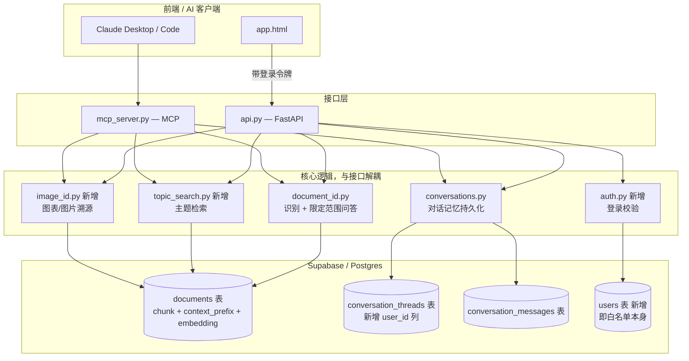

# Sinolume 内部分析师配套工具 — 技术方案 v1.2

> 本文档基于 [PRD_v1.2.md](PRD_v1.2.md) 撰写。§4.1、§4.2 是对已经写完并测试过的代码的如实记录（v1.1 交付时超出文档范围的部分）；§4.3-§4.7 是新设计，尚未实现。

## 1. 背景与目标

呼应 PRD v1.2：v1.1 的最小闭环（文字片段溯源、追问、MCP、部署上线）已经交付，但实现过程中做出的对话记忆持久化、回答质量修复，从未写进技术文档。本文档先补齐这两块的如实记录，再给 v1.2 的五个新目标（账号、图表溯源、候选列表、主题检索、RAG 规模化打底）定技术方案。

## 2. 现状分析（v1.1 完成后）

- 核心逻辑（`document_id.py`、`conversations.py`）与接口解耦：网页走 `api.py`（FastAPI），AI 客户端走 `mcp_server.py`（MCP），两条路径调用同一套函数，行为不会不一致。
- 文字片段溯源用"字面重合度优先、embedding 相似度兜底"两道门槛（`LITERAL_MATCH_THRESHOLD=0.6`、`EMBEDDING_MATCH_THRESHOLD=0.83`），已实测验证能区分"原文"与"话题相关但非原文"。
- 检索用 Supabase/pgvector 的 `match_documents`（向量）+ `keyword_search`（关键词）混合检索，`documents` 表在原有 `content`/`embedding` 基础上加了 `source_document` 字段——这是跟客户端项目 `documents` 表结构的唯一差异，也是这个项目"能报出具体是哪份文档"的根本前提。
- 对话记忆和回答质量目前是"实现超前于文档"的状态（见 §4.1、§4.2），账号、图表、候选列表、主题检索、规模化打底目前完全没有代码，是 §4.3 起的新设计范围。
- 语料库目前只有 4 份文本文档（153 个 chunk），最大的一份（出口管制白皮书）134 个 chunk——本文档几处设计（尤其 §4.7）是在语料库还小、改动代价低的现在提前做的，不是在解决"几千份报告"这个规模本身的问题。

## 3. 总体架构设计

## 4. 详细设计

### 4.1 对话记忆与历史管理（已实现，如实记录）

- 新增两张表：`conversation_threads`（`session_id` 主键、`title`、`source_document`、`created_at`/`updated_at`）、`conversation_messages`（`session_id` 外键、`role`、`content`、`created_at`）——只存"归属 + 标题"索引和原始问答文字，不重复存检索用的向量数据。
- `conversations.ask_and_persist(question, source_document, session_id)` 是唯一的写入入口，`api.py` 的 `/ask` 和 `mcp_server.py` 的 `ask_document` 都调用它，保证网页和 MCP 两条路径行为一致：`session_id` 为空则新建线程（标题取问题前 60 字），否则读出该线程历史，连同新一轮问答一起交给 `document_id.answer_within_document`，问答完成后把两条消息写回、更新线程时间戳。
- **上下文指代理解**（PRD Requirement 6）靠 `document_id._contextualize_for_rerank()`：把最近几轮对话拼进用于 rerank 的查询文本里，让"这个/那个"这类指代在检索阶段就能对齐到之前聊的内容，而不是等生成阶段才"猜"。
- 前端（`app.html`）侧边栏拉取 `GET /conversations` 渲染列表，点击调用 `GET /conversations/{id}` 还原消息、`DELETE /conversations/{id}` 删除；"New chat" 清空 `session_id` 回到"粘贴片段识别"起始状态，从设计上保证新对话不会跟旧对话记忆混在一起（Requirement 10）。

### 4.2 回答质量与具体性（已实现，如实记录）

- 根因是"不管文档多大，塞进答案的片段数量都写死成一个小数字"。`document_id._default_top_n(chunk_count) = min(20, max(5, chunk_count // 4))`：短文档（5-7 个 chunk）仍是 5 个左右，134 个 chunk 的白皮书能拿到 20 个，按文档规模动态调整（Requirement 13）。
- `SPECIFICITY_RULE` 加进生成回答的 prompt：要求优先引用原文具体数字/名称/机构，不能用"various/several/significant"这类模糊词代替原文已有的具体说法（Requirement 11）。
- **自我核查**（Requirement 12）：`document_id._self_check_and_refine()` 是生成回答之后的第二次 LLM 调用，让模型对照实际检索到的 `context_text` 审查刚才那版回答——有没有漏掉明显相关的内容、有没有本可以具体化却被模糊词带过的地方、有没有说了原文不支持的内容，有问题就重写，没问题原样返回。这一步只在确实有 `context_chunks` 时才跑（避免对"文档里没有相关内容"这类拒答场景做无意义的二次调用）。
- 代价：每次追问从 1 次生成 LLM 调用变成 2 次（生成 + 核查），延迟和成本翻倍。目前语料库规模下可接受，语料库和并发量上来后需要重新评估要不要把这一步做成可选（比如只在长文档/宽泛问题时触发，而不是每次都跑）。

### 4.3 图表/图片溯源（新设计）

**技术路径（已确认）**：不引入独立 OCR 库，用同一个多模态模型一次性完成"读图上文字 + 生成语义描述"，理由是少一个系统级依赖（Tesseract 在 Windows 上安装麻烦），代价是对小字号/低清晰度图片的文字识别准确度可能不如专用 OCR，这个代价目前判断可以接受，后续实测如果发现文字识别是主要误判来源，再补一条独立 OCR 路径。

- 新增 `image_id.py`，核心函数 `describe_image(image_bytes) -> str`：把图片和一段结构化提示交给视觉模型（`gpt-4o-mini` 的视觉输入），要求它在一次回复里同时给出：(a) 图上出现的所有文字（标题、坐标轴、图例逐字转录）；(b) 图表类型（柱状/折线/饼图等）、比较的对象、数据走势的语义描述。**(b) 这部分是精准区分 Requirement 15（"文字相同但内容/来源不同"）的关键**——要求模型描述具体的数值走势和比较对象，而不只是转录轴标签文字，这样两张轴标签相同但实际数据不同的图表，生成的描述文本会有实质差异，embedding 相似度才能把它们分开。
- `identify_source_from_image(image_bytes)`：调用 `describe_image` 拿到文字描述后，直接复用现有 `document_id.identify_source()` 走同一套字面匹配 + embedding 匹配逻辑——图片场景下"字面匹配"命中率会低很多（除非图片就是一段文字截图），主要靠 embedding 这道门槛，这是预期行为，不是 bug。
- 新增 `POST /identify-image`（接受 base64 图片）、MCP 新增 `identify_image_document` 工具，返回结构与 `identify_document` 一致，多带一个 `image_description` 字段用于前端展示"系统读到的图片内容"，方便用户核实识别依据。
- 语料入库侧不需要改动——匹配的是"图片生成的描述"与"现有文本语料"，不需要反过来给语料库存图片。

### 4.4 候选列表机制（新设计）

- `document_id.identify_source()` 现在在"没到匹配门槛"时只返回单个最接近的候选（`closest_document`/`closest_similarity`）。改成三段式判断：
  - `similarity >= EMBEDDING_MATCH_THRESHOLD (0.83)` → 直接判定匹配（不变）
  - `CANDIDATE_THRESHOLD (0.65) <= similarity < 0.83` → 判定"不确定"，返回 embedding 相似度排名前 3 的文档作为候选列表，而不是单一猜测
  - `similarity < 0.65` → 判定"没有匹配"，不返回候选，避免把明显不沾边的文档也塞进候选（呼应 Requirement 17"候选列表本身也需要保持相关性"）
- `CANDIDATE_THRESHOLD=0.65` 是延续 v1.1 里 `EMBEDDING_MATCH_THRESHOLD=0.83` 定阈值时同样的做法——凭经验设一个保守起点，不是统计验证过的边界，需要拿真实语料测试后微调（PRD Open Question 2 的答案：先给一个可运行的默认值，具体"多接近算接近"留给实测调整，不是本文档能一次定死的）。
- 前端：候选列表以"你是不是想找这几份文档之一？"的形式展示，每个候选可点击直接进入该文档的追问模式——用户手动确认，系统不替用户做最终判断。

### 4.5 主题检索（新设计）

- 新增 `topic_search.py`，核心函数 `search_topic(topic_query)`：对全语料库跑 `hybrid_search`（不像 `identify_source`/`answer_within_document` 那样限定在单一文档），取回相关 chunk 后按 `source_document` 分组，只保留至少有一个 chunk 通过 `MIN_CONTEXT_SCORE` 的文档。
- **输出形态**：按文档逐一呈现"这份文档怎么说"，不融合成一段综合性的话——这个选择是延续项目一贯原则（识别结果永远标注具体来源，不同来源不能混在一起），不是这次新引入的判断标准。每个文档一段独立生成的 1-2 句摘要，只基于该文档自己的 chunk，不参考其他文档内容（复用 `document_id.py` 里"每个来源独立生成、禁止跨来源编造联系"的做法）。
- 与"文字片段溯源"共享语料库和底层检索函数，但入口、输出结构、prompt 都是独立的——不复用 `identify_source`/`answer_within_document`，避免两种场景（"我有片段找出处" vs "我有话题找相关文档"）的逻辑纠缠在一起。
- 新增 `POST /search-topic`、MCP 新增 `search_topic` 工具。

### 4.6 账号与访问控制（新设计）

- 复用客户端项目 `auth.py` 已经验证过的模式：bcrypt 哈希密码、JWT 令牌（30 天有效期）。
- **白名单存储机制（PRD Open Question 3 的答案）**：不单独建白名单表。`users` 表本身就是白名单——这个项目不提供任何自助注册入口（对应 Requirement 20），新增可登录账号只能由管理者（现阶段就是你自己）手动向 `users` 表插入一行 `username` + `password_hash`。"存在于 `users` 表" 和 "在白名单里" 是同一件事，不需要维护两份数据保持同步。
- `conversation_threads` 表新增 `user_id` 列（外键指向 `users.id`）。`/ask` 建线程时带上当前登录用户的 `user_id`；`/conversations`、`/conversations/{id}`、`DELETE /conversations/{id}` 全部按 `user_id` 过滤，跨账号访问直接 404（不是 403——不暴露"这个 id 存在但不是你的"这个信息）。
- 迁移说明：现有测试阶段产生的对话记录没有 `user_id`（当时还没有账号概念），新增列允许为空，历史空值记录视为"孤儿数据"，上线前手动清空测试数据即可，不需要写数据迁移脚本。

### 4.7 RAG 规模化打底（新设计）

**范围（已确认）**：完整做——入库时给每个片段生成上下文说明，不是先做便宜的部分、贵的部分往后拖。

- **Contextual Retrieval**：`embed_and_store.py` 切好 chunk 之后，多一步 `generate_context_prefix(full_document_text, chunk)`：把整篇文档和这个 chunk 一起交给 LLM，让它写 1-2 句"这个片段在文档里处于什么位置、讲的是什么"的说明。`documents` 表新增 `context_prefix` 列——`content` 列保持原文不变（回答生成阶段展示给用户的还是干净的原文，不夹杂这段说明文字），实际参与 embedding 和关键词索引的是 `context_prefix || ' ' || content` 拼接后的文本。
  - `match_documents`/`keyword_search` 两个 SQL 函数需要同步改：向量检索基于新的拼接文本生成的 embedding；`keyword_search` 的 `to_tsvector` 也要索引拼接文本，而不是只索引 `content`。
  - 成本：语料入库时每个 chunk 多一次 LLM 调用，现在 153 个 chunk 一次性跑完成本很低；语料库变大后，这个成本会线性增长，但只发生在"新文档入库"这个时间点，不影响线上问答的实时性能。
- **分块方式**：从现在的"纯按字符数、句子边界累加"，换成基于 token 计数的切分（用 `tiktoken` 而不是字符数），默认块大小调到约 512 token。**不做**基于规则的章节/标题识别（比如"短独立行当标题"这类启发式）——白皮书这类 PDF 转文字的文档版式很乱，页眉页脚、作者简介会跟正文标题混在一起，硬写规则容易识别错、越改越乱；Contextual Retrieval 这一步本身就是把"这个片段属于文档哪个部分"这个理解工作交给 LLM 去做，能覆盖规则识别想解决的同一个问题，不需要再单独维护一套规则。
- **候选池放大**：`retrieval.py` 的 `MATCH_COUNT` 从写死的 `3` 改成可传参，由调用方按场景决定——`identify_source` 这类"找单一最佳匹配"场景仍用较小的数（比如 5），`search_topic`（§4.5）这类"找所有相关文档"场景用更大的数（比如 20）。不是所有调用都统一放大到一个新的固定值，而是让"候选池该多大"变成一个可以按需调整的参数，而不是硬编码常量。

## 5. 风险与应对

| 风险 | 说明 | 应对 |
|---|---|---|
| 自我核查步骤让每次追问延迟/成本翻倍 | §4.2 的二次 LLM 调用是新增开销 | 现在语料库规模下可接受；后续如果并发量上来，考虑改成"只在长文档/宽泛问题时触发" |
| 图表识别不用独立 OCR，小字号/低清晰度图片文字识别可能不够准 | §4.3 用视觉模型一次性完成，权衡了依赖复杂度和识别精度 | 先上线用真实图表测试；如果实测发现文字识别是主要误判来源，再补一条独立 OCR 路径，不是不能改 |
| 候选列表阈值（`CANDIDATE_THRESHOLD=0.65`）是经验值，未经统计验证 | 跟 v1.1 定 `EMBEDDING_MATCH_THRESHOLD` 时同样的局限 | 需要拿真实语料测试后微调，不是本文档能一次定死的 |
| Contextual Retrieval 让入库流程变慢、变贵 | 每个 chunk 入库时多一次 LLM 调用 | 只发生在"新文档入库"这个时间点，现在语料库规模下影响很小；语料库大规模增长后需要重新评估批量入库的耗时和成本 |
| `users` 表即白名单，没有独立的账号管理界面 | 加新账号只能手动跑 SQL，不是一个产品化的管理流程 | 符合 PRD 里"轻量登录、不做企业级账号体系"的既定取舍，不是遗漏 |
| 主题检索和文字片段溯源共享语料库但逻辑独立，两套 prompt/门槛后续可能不一致演进 | §4.5 特意不复用 `identify_source` 逻辑 | 目前判断两个场景语义不同、不应该强行复用；如果后续发现两边规则经常需要同步改动，再评估要不要抽共同逻辑 |

## 6. PRD Open Questions 解决方案

| # | PRD Open Question | 本文档的处理 |
|---|---|---|
| 1 | Goal 8（RAG 规模化打底）具体做到什么程度算"打好地基" | §4.7：Contextual Retrieval 全量做、分块换成 token 级、候选池改成可调参数——三项都定了具体方案，验收看 §5 风险表里的实测验证 |
| 2 | 候选列表"足够接近"怎么衡量 | §4.4：给了 `CANDIDATE_THRESHOLD=0.65` 这个可运行的默认值，明确标注是经验值待实测调整 |
| 3 | 白名单具体怎么维护 | §4.6：`users` 表本身即白名单，不单独维护 |
| 4 | 主题检索和老项目通用问答边界会不会重复 | §4.5：这个项目的主题检索输出是"按内部文档逐一列出观点"，跟老项目"融合内外部信息回答一个问题"的定位不同，边界在于是否强制按来源拆分呈现 |
| 5 | 账号、图表溯源等几项开发顺序能否并行 | 技术上互相独立（账号是访问控制层，图表溯源是新的识别入口，候选列表是识别逻辑的分支，主题检索是独立模块）——没有强依赖，理论上可以并行，具体排期留给实现阶段 |

## 7. 附录

**涉及改动/新增的文件**

- 新增：`image_id.py`（图表/图片描述与溯源）、`topic_search.py`（主题检索）、`auth.py`（登录令牌签发与校验，参照客户端项目同名文件）
- 改动：`document_id.py`（`identify_source` 加候选列表三段式判断）、`retrieval.py`（`MATCH_COUNT` 改为可传参、embedding 查询基于拼接后的上下文文本）、`embed_and_store.py`（入库新增 `generate_context_prefix` 步骤、分块换成 token 级）、`api.py`（新增 `/identify-image`、`/search-topic`，`/ask` 与 `/conversations` 系列端点加登录校验和 `user_id` 归属检查）、`mcp_server.py`（新增 `identify_image_document`、`search_topic` 工具）、`app.html`（登录页/登出、候选列表 UI、图片上传入口）、`setup_supabase.sql`（`documents` 表加 `context_prefix` 列，`match_documents`/`keyword_search` 函数同步改）、`setup_conversations.sql`（`conversation_threads` 加 `user_id` 列）

**仍需在实现阶段单独产出/明确的内容**

- `CANDIDATE_THRESHOLD` 等新增阈值的实测调优（需要构造真实测试用例集，不止靠人工感觉判断）
- 图表识别的测试用例集（"文字相同但来源/内容不同"、"视觉形式不同"这类样例目前还没有真实素材）
- 账号管理的具体操作流程写成一份简短的操作手册（哪怕只是"怎么用 SQL 加一个新账号"这几行命令）
